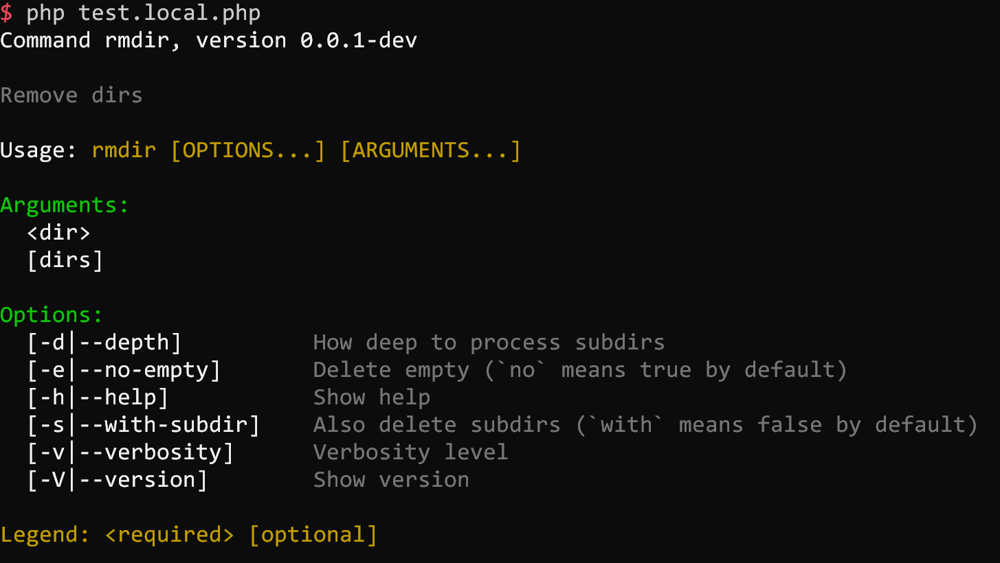
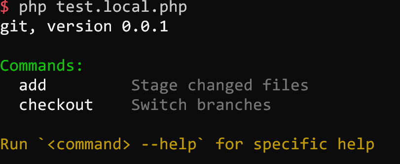

## adhocore/cli

Framework agnostic Command Line Interface utilities and helpers for PHP. Build Console App with ease, fun and love.

[](https://github.com/adhocore/php-cli/releases)
[](https://travis-ci.com/adhocore/php-cli?branch=master)
[](https://scrutinizer-ci.com/g/adhocore/php-cli/?branch=master)
[](https://codecov.io/gh/adhocore/php-cli)
[](https://styleci.io/repos/139012552)
[](LICENSE)

- Command line application made easy
- Inspired by nodejs [commander](https://github.com/tj/commander.js) (thanks tj)
- For PHP7 and for good

[](https://github.com/adhocore/phalcon-ext/tree/master/example/cli)

#### What's included

**Core**

- [Argv parser](#as-argv-parser)
- [Cli application](#as-console-app)

**IO**

- [Colorizer](#color)
- [Cursor manipulator](#cursor)
- [Stream writer](#writer)
- [Stream reader](#reader)

## Installation
```bash
composer require adhocore/cli
```

## Usage

### As argv parser

```php
$command = new Ahc\Cli\Input\Command('rmdir', 'Remove dirs');

$command
    ->version('0.0.1-dev')
    // Arguments are separated by space
    // Format: `<name>` for required, `[name]` for optional
    //  `[name:default]` for default value, `[name...]` for variadic (last argument)
    ->arguments('<dir> [dirs...]')
    // `-h --help`, `-V --version`, `-v --verbosity` options are already added by default.
    // Format: `<name>` for required, `[name]` for optional
    ->option('-s --with-subdir', 'Also delete subdirs (`with` means false by default)')
    ->option('-e,--no-empty', 'Delete empty (`no` means true by default)')
    // Specify santitizer/callback as 3rd param, default value as 4th param
    ->option('-d|--depth [nestlevel]', 'How deep to process subdirs', 'intval', 5)
    ->parse(['thisfile.php', '-sev', 'dir', 'dir1', 'dir2', '-vv']) // `$_SERVER['argv']`
;

// Print all values:
print_r($command->values());

/*Array
(
    [help] =>
    [version] => 0.0.1
    [verbosity] => 3
    [dir] => dir
    [dirs] => Array
        (
            [0] => dir1
            [1] => dir2
        )

    [subdir] => true
    [empty] => false
    [depth] => 5
)*/

// To get values for options except the default ones (help, version, verbosity)
print_r($command->values(false));

// Pick a value by name
$command->dir;   // dir
$command->dirs;  // [dir1, dir2]
$command->depth; // 5
```

#### Command help

It can be triggered manually with `$command->showHelp()` or automatic when `-h` or `--help` option is passed to `$command->parse()`.

For above example, the output would be:


#### Command version

It can be triggered manually with `$command->showVersion()` or automatic when `-V` or `--version` option is passed to `$command->parse()`.

For above example, the output would be:
```
0.0.1-dev
```

### As console app

Definitely check [adhocore/phint](https://github.com/adhocore/phint) - a real world console application made using `adhocore/cli`.

We simulate a `git` app with limited functionality of `add`, and `checkout`.
You will see how intuitive, fluent and cheese building a console app is!

#### Git app

```php
$app = new Ahc\Cli\Application('git', '0.0.1');

$app
    // Register `add` command
    ->command('add', 'Stage changed files', 'a') // alias a
        // Set options and arguments for this command
        ->arguments('<path> [paths...]')
        ->option('-f --force', 'Force add ignored file', 'boolval', false)
        ->option('-N --intent-to-add', 'Add content later but index now', 'boolval', false)
        // Handler for this command: param names should match but order can be anything :)
        ->action(function ($path, $paths, $force, $intentToAdd) {
            array_unshift($paths, $path);

            echo ($intentToAdd ? 'Intent to add ' : 'Add ')
                . implode(', ', $paths)
                . ($force ? ' with force' : '');
        })
        // Done setting up this command for now, tap() to retreat back so we can add another command
        ->tap()
    ->command('checkout', 'Switch branches', 'co') // alias co
        ->arguments('<branch>')
        ->option('-b --new-branch', 'Create a new branch and switch to it', false)
        ->option('-f --force', 'Checkout even if index differs', 'boolval', false)
        ->action(function ($branch, $newBranch, $force) {
            echo 'Checkout to '
                . ($newBranch ? 'new ' . $branch : $branch)
                . ($force ? ' with force' : '');
        })
;

// Parse only parses input but doesnt invoke action
$app->parse(['git', 'add', 'path1', 'path2', 'path3', '-f']);

// Handle will do both parse and invoke action.
$app->handle(['git', 'add', 'path1', 'path2', 'path3', '-f']);
// Will produce: Add path1, path2, path3 with force

$app->handle(['git', 'co', '-b', 'master-2', '-f']);
// Will produce: Checkout to new master-2 with force
```

### Organized app

Instead of inline commands/actions, we define and add our own commands (having `interact()` and `execute()`) to the app:

```php

class InitCommand extends Ahc\Cli\Input\Command
{
    public function __construct()
    {
        parent::__construct('init', 'Init something');

        $this
            ->argument('<arrg>', 'The Arrg')
            ->argument('[arg2]', 'The Arg2')
            ->option('-a --apple', 'The Apple')
            ->option('-b --ball', 'The ball')
            // Usage examples:
            ->usage(
                '<bold>  init</end> <comment>--apple applet --ball ballon <arggg></end><eol/>' .
                '<bold>  init</end> <comment>-a applet -b ballon <arggg> [arg2]</end><eol/>'
            );
    }

    // This method is auto called before `self::execute()` and receives `Interactor $io` instance
    public function interact(Ahc\Cli\IO\Interactor $io)
    {
        // Collect missing opts/args
        if (!$this->apple) {
            $this->set('apple', $io->prompt('Enter apple'));
        }

        if (!$this->ball) {
            $this->set('ball', $io->prompt('Enter ball'));
        }

        // ...
    }

    // When app->handle() locates `init` command it automatically calls `execute()`
    // with correct $ball and $apple values
    public function execute($ball, $apple)
    {
        $io = $this->app()->io();

        $io->write('Apple ' . $apple, true);
        $io->write('Ball ' . $ball, true);

        // ...
    }
}

class OtherCommand extends Ahc\Cli\Input\Command
{
    // ...
}

// Init App with name and version
$app = new Ahc\Cli\Application('App', 'v0.0.1');

// Add commands with optional aliases`
$app->add(new InitCommand, 'i');
$app->add(new OtherCommand, 'o');

// Set logo
$app->logo('Ascii art logo of your app');

$app->handle($_SERVER['argv']); // if argv[1] is `i` or `init` it executes InitCommand
```

#### App help

It can be triggered manually with `$app->showHelp()` or automatic when `-h` or `--help` option is passed to `$app->parse()`.
**Note** If you pass something like `['app', cmd', '-h']` to `$app->parse()` it will automatically and instantly show you help of that `cmd` and not the `$app`.

For above example, the output would be:


#### App version

Same version number is passed to all attached Commands. So you can trigger version on any of the commands.

### Cli Interaction

You can perform user interaction like printing colored output, reading user input programatically and  moving the cursors around with provided `Ahc\Cli\IO\Interactor`.

```php
$interactor = new Ahc\Cli\IO\Interactor;
// For mocking io: `$interactor = new Ahc\Cli\IO\Interactor($inputPath, $outputPath)`

$confirm = $interactor->confirm('Are you happy?', 'n'); // Default: n (no)
$confirm // is a boolean
    ? $interactor->greenBold('You are happy :)', true)  // Output green bold text
    : $interactor->redBold('You are sad :(', true);     // Output red bold text

// Single choice
$fruits = ['a' => 'apple', 'b' => 'banana'];
$choice = $interactor->choice('Select a fruit', $fruits, 'b');
$interactor->greenBold("You selected: {$fruits[$choice]}", true);

// Multiple choices
$fruits  = ['a' => 'apple', 'b' => 'banana', 'c' => 'cherry'];
$choices = $interactor->choices('Select fruit(s)', $fruits, ['b', 'c']);
$choices = \array_map(function ($c) use ($fruits) { return $fruits[$c]; }, $choices);
$interactor->greenBold('You selected: ' . implode(', ', $choices), true);

// Promt free input
$any = $interactor->prompt('Anything', rand(1, 100)); // Random default
$interactor->greenBold("Anything is: $any", true);

// Prompting with validation
$nameValidator = function ($value) {
    if (\strlen($value) < 5) {
        throw new \Exception('Name should be atleast 5 chars');
    }

    return $value;
};

// No default, Retry 5 more times
$name = $interactor->prompt('Name', null, $nameValidator, 5);
$interactor->greenBold("The name is: $name", true);
```


### IO Components

The interactor is composed of `Ahc\Cli\Input\Reader` and `Ahc\Cli\Output\Writer` while the `Writer` itself is composed of `Ahc\Cli\Output\Color`. All these components can be used standalone.

#### Color

Color looks cool!

```php
$color = new Ahc\Cli\Output\Color;

echo $color->warn('This is warning');
echo $color->info('This is info');
echo $color->error('This is error');
echo $color->comment('This is comment');
echo $color->ok('This is ok msg');

// Custom style:
Ahc\Cli\Output\Color::style('mystyle', [
    'bg' => Ahc\Cli\Output\Color::CYAN,
    'fg' => Ahc\Cli\Output\Color::WHITE,
    'bold' => 1, // You can experiment with 0, 1, 2, 3 ... as well
]);

echo $color->mystyle('My text');
```

#### Cursor

Move cursor around, erase line up or down, clear screen.

```php
$cursor = new Ahc\Cli\Output\Cursor;

echo  $cursor->up(1) . $cursor->down(2)
    . $cursor->right(3) . $cursor->left(4)
    . $cursor->next(0) . $cursor->prev(2);
    . $cursor->eraseLine() . $cursor->clear()
    . $cursor->clearUp() . $cursor->clearDown()
    . $cursor->moveTo(5, 8); // x, y
```

#### Writer

Write anything in style.

```php
$writer = new Ahc\Cli\Output\Writer;

// Output formatting: You can call methods composed of:
//  ('<colorName>', 'bold', 'bg', 'fg', 'warn', 'info', 'error', 'ok', 'comment')
// ... in any order (eg: bgRedFgBlaock, boldRed, greenBold, commentBgPurple and so on ...)
$writer->bold->green->write('It is bold green');
$writer->boldGreen('It is bold green'); // Same as above
$writer->comment('This is grayish comment', true); // True indicates append EOL character.
$writer->bgPurpleBold('This is white on purple background');

// Many colors with one single call: wrap text with tags `<method>` and `</end>`
// For NL/EOL just use `<eol>` or `</eol>` or `<eol/>`
$writer->colors('<red>This is red</end><eol><bgGreen>This has bg Green</end>');

// All writes are forwarded to STDOUT
// But if you specify error, then to STDERR
$writer->errorBold('This is error');

// Write a normal raw text.
$writer->raw('Enter name: ');

// Creating tables: just pass array of assoc arrays.
// The keys of first array will be taken as heading.
// Heading is auto inflected to human readable capitalized words (ucwords).
$writer->table([
    ['a' => 'apple', 'b-c' => 'ball', 'c_d' => 'cat'],
    ['a' => 'applet', 'b-c' => 'bee', 'c_d' => 'cute'],
]);

// Gives something like:
//
// +--------+------+------+
// | A      | B C  | C D  |
// +--------+------+------+
// | apple  | ball | cat  |
// | applet | bee  | cute |
// +--------+------+------+

// Designing table look and feel: just pass 2nd param $styles.
$writer->table([
    ['a' => 'apple', 'b-c' => 'ball', 'c_d' => 'cat'],
    ['a' => 'applet', 'b-c' => 'bee', 'c_d' => 'cute'],
], [
    // for => styleName (anything that you would call in $writer instance)
    'head' => 'boldGreen', // For the table heading
    'odd'  => 'bold',      // For the odd rows (1st row is odd, then 3, 5 etc)
    'even' => 'comment',   // For the even rows (2nd row is even, then 4, 6 etc)
]);
// 'head', 'odd', 'even' are all the styles for now
// In futrue we may support styling all columns by its name!
```

#### Reader

Read and pre process user input.

```php
$reader = new Ahc\Cli\Input\Reader;

// No default, callback fn `ucwords()`
$reader->read(null, 'ucwords');

// Default 'abc', callback `trim()`
$reader->read('abc', 'trim');
```

### Related

- [adhocore/phalcon-ext](https://github.com/adhocore/phalcon-ext) Phalcon extension using `adhocore/cli`
- [adhocore/phint](https://github.com/adhocore/phint) PHP project scaffolding app using `adhocore/cli`
